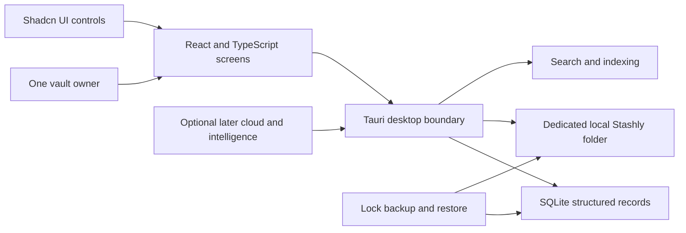
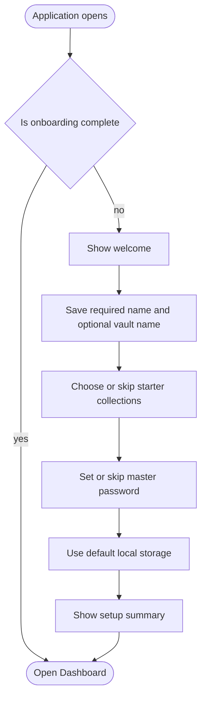
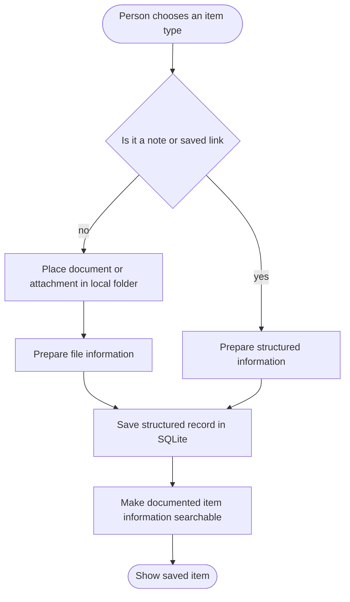
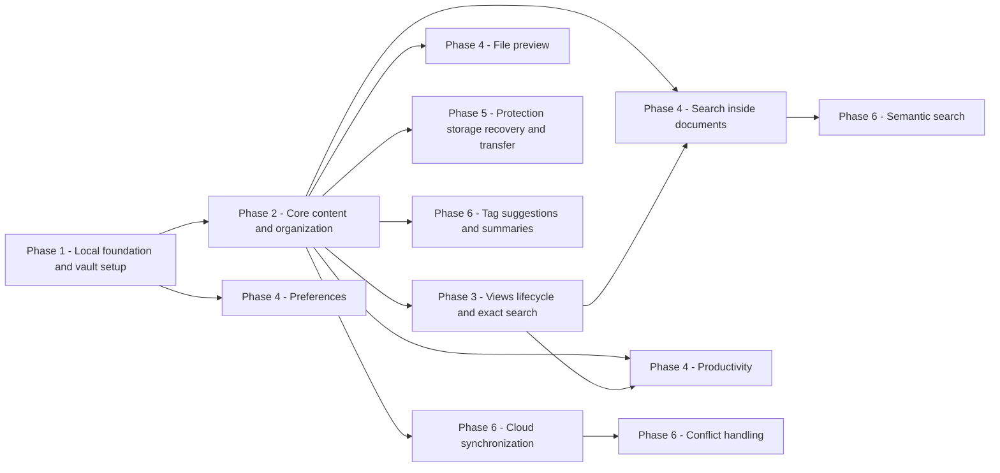

# 04 - DIAGRAMS

[00 - START HERE](00%20-%20START%20HERE.md) · Previous: [03 - SYSTEM ARCHITECTURE](03%20-%20SYSTEM%20ARCHITECTURE.md) · Next: [05 - ROADMAP](05%20-%20ROADMAP.md)

These four diagrams describe proposed behavior, not verified implementation. They are drawn from `MATERIAL/T-00.md`, “Application Flow,” lines 58–64; `MATERIAL/T-01.md`, “Final User Flow,” lines 476–494; and `MATERIAL/T-02.md`, “Detailed Breakdown,” lines 99–119.

## 1. Big picture

**Reading this:** One person uses screens made with the named screen controls. The proposed Tauri boundary reaches structured records and local files. Search, protection, and recovery work across those local stores. Cloud and intelligence remain optional later additions. Matches [03 - SYSTEM ARCHITECTURE](03%20-%20SYSTEM%20ARCHITECTURE.md).

## 2. First launch and onboarding

**Reading this:** Returning users go straight to the Dashboard. New users move through identity, optional collections, optional protection, automatic local storage, and a summary. This follows `MATERIAL/T-01.md`, “Onboarding Flow,” lines 19–33, and “Onboarding State,” lines 410–438.

## 3. Save an item

**Reading this:** Notes and saved links need structured records. Files also need local file storage plus a related structured record. The exact stored shape and failure handling are open because the documents do not define them. This is *drawn from* `MATERIAL/T-02.md`, “Content Management,” lines 51–57, and “Local Storage Architecture,” lines 105–107.

## 4. Phase order

**Reading this:** This is derived sequencing, not an order stated by the documents. Phase 5 branches from core content and does not wait for Phase 4. Preview needs files. Search inside documents needs exact search. Productivity needs the main views. Preferences need only the foundation and completed setup. Semantic search waits for searchable document content. Tag suggestions, summaries, and cloud work draw from core content instead of backup. Conflict handling waits for cloud synchronization. Matches item-level dependencies in [05 - ROADMAP](05%20-%20ROADMAP.md). (*Drawn from* `MATERIAL/T-02.md`, “Context & Dependencies,” lines 29–40; “Search and Document Processing,” lines 109–111; “Security, Backup, and Recovery,” lines 113–115; and “Advanced and Multi-Device Capabilities,” lines 117–119)
